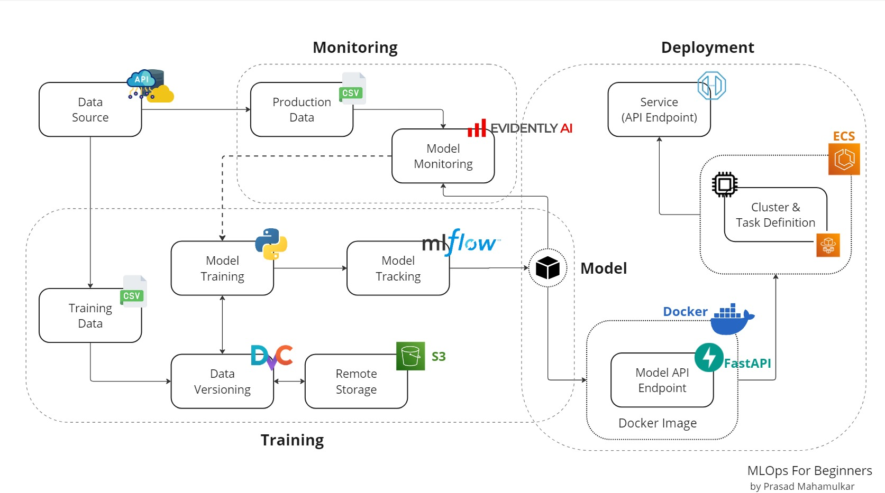

# Insurance Cross-Sell Prediction

[](https://github.com/nou-hub-tech/mlops-project)

A production-ready MLOps project for predicting which customers are likely to buy additional insurance products. Built with proper separation of concerns, environment management, CI/CD, monitoring, and all the good stuff you'd expect in a real-world ML system.

## Architecture



## Quick Start

```bash
git clone https://github.com/nou-hub-tech/mlops-project.git
cd mlops-project
python -m venv venv
source venv/bin/activate  # Windows: venv\Scripts\activate
pip install -r requirements.txt
```

## Running the Project

**Train the model:**
```bash
python main.py
```

**Start the API:**
```bash
uvicorn src.insurance_mlops.api.app:app --reload
```

**With Docker:**
```bash
docker-compose up
```

**Run tests:**
```bash
pytest
```

## Project Structure

- `src/insurance_mlops/` - Main package with pipeline, API, monitoring, and utilities
- `config/` - Environment-specific configs (dev/staging/prod)
- `tests/` - Unit and integration tests
- `scripts/` - Model management utilities
- `docs/` - Documentation

## Features

- Environment separation (dev/staging/prod)
- Data validation layer
- API authentication with health checks and metrics
- MLflow experiment tracking
- Data drift monitoring with Evidently
- CI/CD with GitHub Actions
- Pre-commit hooks for code quality

## License

Apache-2.0
